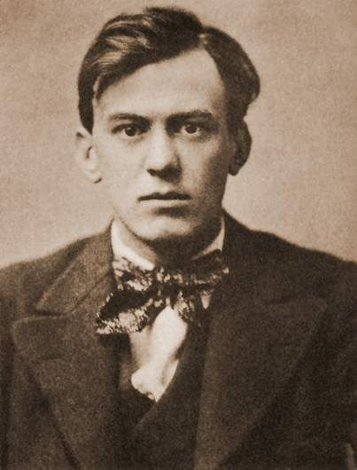
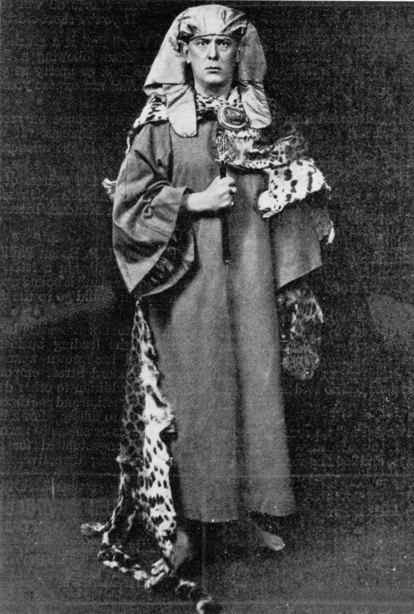

<!DOCTYPE html>
<html lang="en">
  <head>
    <meta charset="UTF-8" />
    <meta http-equiv="X-UA-Compatible" content="IE=edge" />
    <meta name="viewport" content="width=device-width, initial-scale=1.0" />
    <title>Aleister Crowley Bio</title>
    <link rel="stylesheet" href="./assets/css/style.css" />
  </head>
  <body>
    <!-- MENU -->
    <header>
      <nav>
        <ul>
          <li><a href="#about-link">About</a></li>
          <li><a href="#timeline-link">Timeline</a></li>
          <li><a href="#gallery-link">Gallery</a></li>
        </ul>
      </nav>
    </header>

    <!-- INTRO -->
    

      <h1>Aleister Crowley</h1>
      
(10/12/1875 - 12/01/1947)

      <h2>Occultist, founder of Thelema religion. </h2>
    

    <main>
      

        <figure>
          
        </figure>
      

      <!-- ABOUT -->
        
      

        <h1>About</h1>
        

          Aleister Crowley (born Edward Alexander Crowley; 12 October 1875 - 1
          December 1947) was an English occultist, ceremonial magician, poet,
          painter, novelist, and mountaineer. He founded the religion of
          <i
            ><a href="https://en.wikipedia.org/wiki/Thelema" target="_blank"
              >Thelema</a
            ></i
          >, identifying himself as the prophet entrusted with guiding humanity
          into the
          <i
            ><a
              href="https://en.wikipedia.org/wiki/%C3%86on_of_Horus"
              target="_blank"
              >Æon of Horus</a
            ></i
          >
          in the early 20th century. A prolific writer, he published widely over
          the course of his life,
          <i
            ><a
              href="https://en.wikipedia.org/wiki/The_Book_of_the_Law"
              target="_blank"
              >The Book of the Law</a
            ></i
          >, a sacred text that served as the basis for Thelema, is one of his
          most influential work.
        

        

          Crowley gained widespread notoriety during his lifetime, being a
          recreational drug user, bisexual, and an individualist social critic.
          Crowley has remained a highly influential figure over Western
          esotericism and the counterculture of the 1960s, and continues to be
          considered a prophet in Thelema. He is the subject of various
          biographies and academic studies.
        

      

      <!-- TIMELINE -->
        
      

        <h1>Timeline</h1>
        <ul class="timeline-content">
          <li>
            1875 Born in Warwickshire,
            England;
          </li>
          <li>
            1887 Father died of tongue
            Cancer. Crowley described this as a turning point in his life;
          </li>
          <li>
            1895 Adopted the name of
            Aleister and began a three-year course at Trinity College studying
            philosophy;
          </li>
          <li>
            1898 Initiated into the occult
            Outer Order of the Golden Dawn;
          </li>
          <li>
            1899 Purchased the famous
            Boleskine House in Foyers on the shore of Loch Ness in Scotland;
          </li>
          <li>
            1900 Began a series of
            expeditions throughout the world, traveling to Mexico, India and
            France;
          </li>
          <li>
            1904 Arrived in Cairo (Egypt)
            and in April wrote <i>Liber AL vel Legis</i> or
            <i>The Book of the Law</i>;
          </li>
          <li>
            1907 Founded the magical
            organization
            <i
              ><a
                href="https://en.wikipedia.org/wiki/A%E2%88%B4A%E2%88%B4"
                target="_blank"
                >A∴A∴</a
              ></i
            >;
          </li>
          <li>
            1914 Moved to the United States
            and writing for the north-american edition of Vanity Fair;
          </li>
          <li>
            1947 After several attempts to
            give up his addiction on heroin, returned to England and died of
            chronic bronchitis.
          </li>
        </ul>
      

      <!-- GALLERY -->
        
      

        
<h1>Gallery</h1>

        

          

            
          

          

            
          

          

            
          

          

            
          

        

      

    </main>

    <!-- FOOTER -->
    <footer>
      
Page created by
      <a href="https://github.com/ceptex" target="_blank">Caio Teixeira</a>,
      with information from
      <a href="https://en.wikipedia.org/wiki/Aleister_Crowley" target="_blank"
        >Wikipedia</a
      >.

    </footer>
  </body>
</html>
